# Plots & Visual Diagnostics

The plots interviewers ask you to read, sketch, or diagnose from. Each one: what it shows, **how to read it**, what good and bad look like, and the gotcha.

All figures are generated by [`figures/generate_figures.py`](figures/generate_figures.py) — run it to regenerate. They use transparent backgrounds so they work in both light and dark themes.

Companions: [`ML_Algorithms_Cheatsheet.md`](ML_Algorithms_Cheatsheet.md) · [`XGBoost_Trees_Deep_Dive.md`](XGBoost_Trees_Deep_Dive.md) · [`Feature_Engineering_Selection.md`](Feature_Engineering_Selection.md) · [`Glossary.md`](Glossary.md)

---

# Part 1 — Distributions

## 1. Skewness: right-skewed vs symmetric vs left-skewed

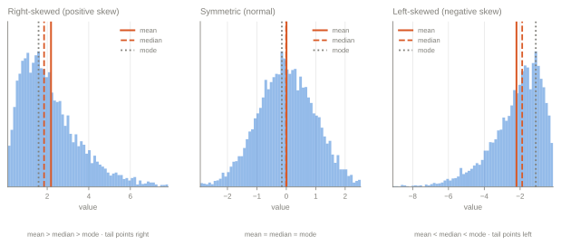

**How to read it**: skew is named for the direction the **tail** points, not where the bulk sits. Right-skewed (positive skew) has a long tail to the *right* even though most mass is on the left — this trips people up constantly.

**The ordering rule** (the thing to memorise):

| Shape | Order | Because |
|---|---|---|
| Right-skewed | **mean > median > mode** | The long right tail drags the mean up |
| Symmetric | mean = median = mode | Nothing pulls it |
| Left-skewed | **mean < median < mode** | The long left tail drags the mean down |

The mean is the only one of the three that is sensitive to extreme values — that's the whole mechanism. The median is the robust centre.

**Real examples**: right-skewed — income, house prices, transaction amounts, claim sizes, time-to-event, word frequencies (most business data is right-skewed). Left-skewed — exam scores with a ceiling, age at death, time-to-failure of reliable parts.

**Why it matters in modelling**: skewed targets violate the normality of residuals assumption in linear regression; skewed features can dominate distance-based models; the mean becomes a misleading "typical value" to report to stakeholders.

**Gotcha**: "skewed left" means the *tail* is left, so the mean is *lower* than the median. If asked "which is higher, mean or median, for income?" the answer is mean — a few billionaires pull it up.

## 2. Fixing skew with a transform

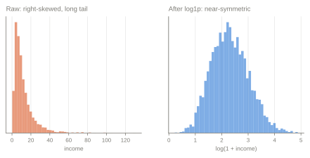

**How to read it**: the log transform compresses the long right tail and expands the crowded left, producing a near-symmetric distribution.

**When to use which**: `log1p` for right-skewed positive data with zeros; `log` if strictly positive; `sqrt` for milder skew or count data; Box-Cox / Yeo-Johnson to *learn* the best power (Yeo-Johnson handles negatives and zeros); rank/quantile transform when you only care about order.

**Gotchas**
- Log of zero or negative values is undefined — hence `log1p`, or a shift.
- If you transform the **target**, predictions come back in log space. Back-transforming with `exp()` gives the *median*, not the mean — you need a smearing/bias correction for an unbiased mean prediction. This is a genuinely good interview answer.
- Tree models don't need it. Splits are order-based, so any monotonic transform of a *feature* leaves the tree unchanged. Transforming a skewed **target** can still help boosting, because the loss is computed on the target scale.

## 3. Box plot anatomy and the 1.5×IQR rule

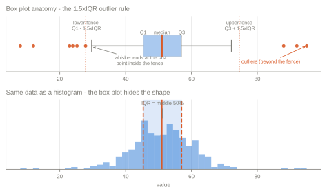

**How to read it**: the box spans Q1 to Q3 (the interquartile range, the middle 50%), the line inside is the **median** (not the mean), and the whiskers reach the furthest data point still *inside* the fences at `Q1 − 1.5×IQR` and `Q3 + 1.5×IQR`. Anything past a fence is plotted as an outlier.

**The distinction that gets tested**: the whisker ends at the last **real data point** inside the fence — not at the fence itself. The fence is a threshold; the whisker is data.

**Where 1.5 comes from**: for a normal distribution the fences sit at about ±2.7σ, covering ~99.3% of the data, so ~0.7% of clean normal data gets flagged. It's a convention, not a test.

**Gotcha (why the second panel is there)**: a box plot shows five numbers and hides everything else. **A bimodal distribution and a flat one can produce identical box plots.** Always pair it with a histogram, violin, or strip plot. And "outlier" here means "unusual under the IQR rule" — not "wrong" and not "delete it".

---

# Part 2 — Normality & QQ Plots

## 4. QQ plots — the four shapes

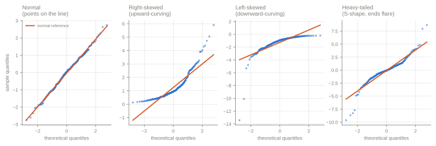

**What it is**: a scatter of your data's quantiles (y) against the quantiles a reference distribution — usually the normal — would produce (x). If your data follows the reference, the points fall on a straight line.

**How to read the four signatures** — this is the part worth memorising:

| Pattern | Diagnosis |
|---|---|
| Points on the line | Consistent with normal |
| **Curves upward** (both ends above the line at the right, below at the left) | **Right-skewed** |
| **Curves downward** | **Left-skewed** |
| **S-shape / both ends flare away** | **Heavy tails** (more extreme values than normal — leptokurtic) |
| Both ends bend *toward* the line | Light tails (platykurtic) |
| Discrete steps / plateaus | Rounded, binned, or censored data |
| A few points off at one end only | Individual outliers, not a shape problem |

**When you'd use it**: checking the normality-of-residuals assumption for linear regression inference, validating a distributional assumption before a parametric test, and spotting heavy tails before trusting a mean/σ-based model.

**Why QQ over a normality test**: with large n, Shapiro-Wilk or Kolmogorov-Smirnov reject normality for trivially small, harmless deviations; with small n they lack power to detect real ones. The QQ plot shows you *how* and *how badly* it deviates, which is the actionable information. Say this if asked "how would you test for normality?"

**Gotcha**: linear regression does **not** require normally distributed *features*, or even a normally distributed *target*. It's the **residuals** whose normality matters, and only for inference (p-values, confidence intervals) — not for the point predictions.

---

# Part 3 — Bias, Variance & Fit

## 5. The bias-variance decomposition

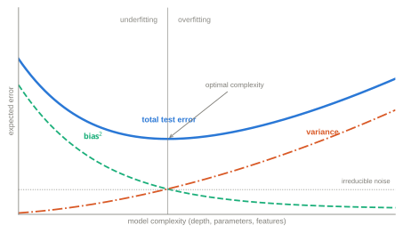

**How to read it**: expected test error decomposes into three parts:

```
Expected error  =  Bias²  +  Variance  +  Irreducible noise
```

As complexity rises, **bias² falls** (the model can represent more) while **variance rises** (the model chases the specific training sample). Their sum is **U-shaped**, and the minimum is the optimal complexity. The noise floor is the error no model can beat.

**Left of the minimum = underfitting** (high bias): the model is too simple, and it's wrong in the same way every time. **Right = overfitting** (high variance): the model is too flexible and wrong in a different way on every resample.

**How to move along the axis**: complexity here means tree depth, number of parameters, polynomial degree, feature count, number of boosting rounds — anything that increases the hypothesis space.

**The levers**
| Problem | Fix |
|---|---|
| High bias | More complex model, more/better features, less regularization, train longer |
| High variance | Regularize, simplify, more data, bagging/ensembling, early stopping, feature selection |

**Gotcha**: more data reduces **variance** but not **bias** — that's why the "just get more data" reflex fails on an underfitting model. Also: the classic U-curve is the textbook picture, but very over-parameterized models (large neural nets) can show *double descent*, where test error falls again past the interpolation threshold. Worth mentioning as a caveat if the interviewer is research-leaning.

## 6. Learning curves — diagnosing which problem you have

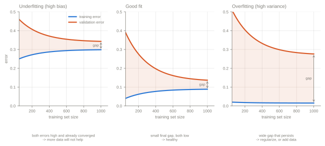

**How to read it**: plot training and validation error against **training set size**. Training error **rises** toward the asymptote (fitting more data is harder) while validation error **falls** — they converge from opposite directions. The two things to look at are the **level** they converge to and the **gap** between them.

| Signature | Diagnosis | What to do |
|---|---|---|
| Both converge **high**, tiny gap | **Underfitting / high bias** | More complexity or better features. **More data will not help** — the curves already flattened |
| Both converge **low**, small gap | Good fit | Ship it |
| Training **very low**, validation **much higher**, gap persists | **Overfitting / high variance** | Regularize, simplify, or add data — the gap is still closing, so data helps here |

**Why this plot earns its place**: it's the cheapest way to answer "should we invest in collecting more data?" — a question with real budget attached. A flat, converged, high pair of curves says no; a still-narrowing gap says yes.

**Gotcha**: a training-error curve that *falls* as data grows is drawn wrong. Fitting 1000 points is strictly harder than fitting 50, so training error goes **up**. (Note the distinct plot with *epochs* on the x-axis — a validation-loss curve turning upward mid-training is the overfitting signal there, and it's what early stopping monitors.)

---

# Part 4 — Classification Metrics

## 7. Accuracy vs precision (the measurement sense)

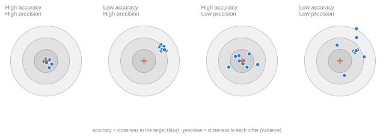

**How to read it**: **accuracy** is how close the shots are to the *target* — systematic error, i.e. **bias**. **Precision** is how close the shots are to *each other* — random error, i.e. **variance**. They're independent: you can be consistently wrong (tight cluster, off-centre) or averagely right but erratic (spread around the bullseye).

**Careful — "precision" has two different meanings**, and interviewers sometimes probe whether you know which one is being asked about:

| Sense | Meaning |
|---|---|
| **Measurement / metrology** (this figure) | Reproducibility, low variance, tight clustering |
| **Classification metric** (next figure) | `TP / (TP + FP)` — of what I flagged positive, how much really was |

If a question says "precision and recall", it's the classification sense. If it says "accuracy and precision" with no recall in sight, it's probably this one. Ask.

**Why it's worth knowing**: this figure is the cleanest intuition pump for bias vs variance — the same decomposition as §5, in physical form.

## 8. The confusion matrix and everything derived from it

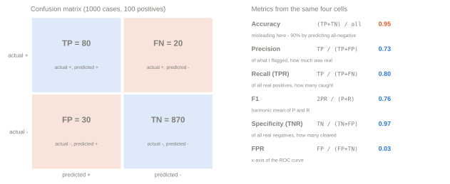

**How to read it**: four cells, and every classification metric is a ratio of them. Note the orientation — rows are **actual**, columns are **predicted**. (Layouts vary between textbooks and libraries; `sklearn.confusion_matrix` returns rows=actual, columns=predicted with labels in sorted order, so always check which convention a given matrix uses before reading it.)

| Metric | Formula | Reads as |
|---|---|---|
| **Accuracy** | (TP+TN) / all | Overall hit rate — **misleading under imbalance** |
| **Precision** (PPV) | TP / (TP+FP) | Of what I flagged, how much was real |
| **Recall** / TPR / sensitivity | TP / (TP+FN) | Of all real positives, how many I caught |
| **Specificity** / TNR | TN / (TN+FP) | Of all real negatives, how many I cleared |
| **FPR** | FP / (FP+TN) = 1 − specificity | The ROC x-axis |
| **F1** | 2PR / (P+R) | Harmonic mean of precision and recall |
| **NPV** | TN / (TN+FN) | Of what I cleared, how much was really clean |

**The accuracy trap, concretely**: in the figure, 100 positives out of 1000. A model that predicts "negative" for everything scores **90% accuracy** and catches zero positives. Accuracy is nearly useless here — this is the number-one reason to reach for precision/recall or PR-AUC.

**Why F1 uses the harmonic mean**: the harmonic mean is dominated by the smaller value, so F1 stays low unless *both* precision and recall are decent. An arithmetic mean would let precision 1.0 / recall 0.0 score 0.5, which would be nonsense. Use **F-beta** when you want to weight one side (β > 1 favours recall).

**Gotchas**
- Recall and specificity are *not* complements — they're computed on different denominators (actual positives vs actual negatives).
- Precision depends on **prevalence**; recall does not. The same model deployed where fraud is rarer will show worse precision at the same threshold, with no change to the model. This surprises people in production and is a strong point to raise.

## 9. ROC vs Precision-Recall under imbalance

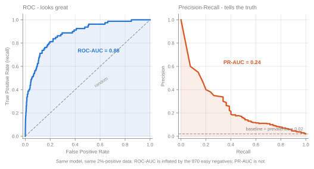

**How to read them**: **ROC** plots TPR against FPR across all thresholds; the diagonal is random, up-and-left is better, and AUC is the area beneath. **PR** plots precision against recall; the baseline is the **positive-class prevalence**, not 0.5.

**Why they disagree here** — the key insight: both panels are the *same model on the same data* (2% positives). ROC-AUC looks strong because FPR has the huge negative class in its denominator, so even a large absolute number of false positives moves FPR only slightly. PR-AUC has no such cushion: precision's denominator is what you *flagged*, so false positives hurt immediately.

**Which to use**
| Use | When |
|---|---|
| **PR-AUC** / average precision | Imbalanced data, and you care about the positive class (fraud, disease, defaults, moderation) |
| **ROC-AUC** | Roughly balanced classes, or you genuinely care about both classes equally |

**Interpretation of ROC-AUC worth knowing**: it equals the probability that a randomly chosen positive is ranked above a randomly chosen negative. It's a pure **ranking** measure — threshold-free and calibration-free.

**Gotchas**: ROC-AUC is *invariant* to class balance, which is exactly why it can flatter a model that's useless in production. A PR curve can be non-monotonic (precision jitters at low recall where few samples are involved). And a high AUC says the ranking is good — it says nothing about whether the probabilities are trustworthy (see §11).

## 10. Threshold selection — precision, recall and F1 across the cut

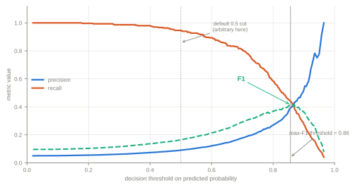

**How to read it**: sweeping the threshold from 0 to 1, **recall falls monotonically** (a higher bar means catching fewer positives) while **precision generally rises** (what you do flag is more likely real). F1 peaks somewhere in between. **0.5 is an arbitrary default with no special status.**

**How to actually pick the threshold**
- Maximise F1 (or F-beta) if you want a single balanced operating point.
- **Fix one metric to a business requirement**: "precision ≥ 90%" or "recall ≥ 80%", then read off the best achievable other.
- **Minimise expected cost**: `cost = FN × (cost of a miss) + FP × (cost of a false alarm)`. This is the most defensible answer in a business interview.
- **Precision@k** when review capacity is fixed ("analysts can review 500 alerts/day").
- Youden's J (`max(TPR − FPR)`) if you have no cost information.

**Tiered thresholds** are what production systems actually do: auto-approve below a low cut, auto-block above a high cut, and route the middle band to human review. Two thresholds, not one.

**Gotcha**: XGBoost and sklearn have **no threshold hyperparameter** — `predict()` hard-codes 0.5. Threshold selection happens *after* the model, on `predict_proba` output, and belongs in config so ops can move it without retraining. See [`XGBoost_Trees_Deep_Dive.md` §4](XGBoost_Trees_Deep_Dive.md#4-where-do-you-set-the-classification-threshold-in-xgboost).

## 11. Calibration curve (reliability diagram)

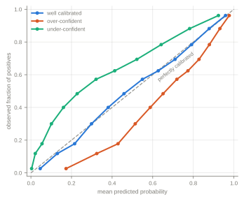

**How to read it**: bin predictions by predicted probability, and plot the **observed** fraction of positives in each bin against the **mean predicted** probability. Perfect calibration lies on the diagonal: among cases predicted at 0.7, about 70% should actually be positive.

**Below the diagonal = over-confident** (says 0.9, only 0.7 happen). **Above = under-confident.**

**When calibration matters** (as opposed to just ranking): whenever the probability itself is consumed downstream — expected-loss calculations (`P(default) × exposure`), expected-value decisions, thresholding against a cost ratio, or showing a risk score to a human. If you only need a ranked list, calibration is irrelevant and AUC is enough.

**Fixes**: Platt scaling (fit a logistic on held-out scores) or isotonic regression (non-parametric, more flexible, needs more data). Always fit the calibrator on **held-out** data, never on the training set.

**What decalibrates models**: class-weighting and resampling (SMOTE, undersampling, `scale_pos_weight`) systematically shift predicted probabilities upward — so if you fixed imbalance that way and then need real probabilities, you must recalibrate. Tree ensembles like Random Forest tend to be under-confident at the extremes (averaging pulls toward the middle); SVMs and boosted trees are often over-confident.

**Gotcha**: a model can have excellent ROC-AUC and terrible calibration. AUC only cares about *order*; calibration cares about *level*. Naming that distinction is a strong answer.

---

# Part 5 — Ranking & Risk

## 12. Cumulative gains and lift

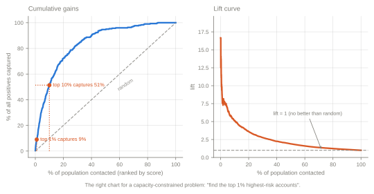

**How to read it**: sort the population by predicted score, descending. The **gains curve** shows what fraction of all positives you've captured after contacting the top x%. The diagonal is random. The **lift curve** is the same information as a ratio: `lift = (% captured) / (% contacted)` — lift 5 at the top decile means that decile has 5× the base rate.

**Why these are the right charts for capacity-constrained problems**: when the ask is "find the top 1% highest-risk accounts" or "we can call 20,000 customers", the question isn't global accuracy — it's *how much of the signal sits in the slice you can actually action*. Precision@k, gains, and lift answer that directly. See the loan-recovery question in [`../Question_Bank/`](../Question_Bank/README.md).

**Reading it out loud to a stakeholder**: "contacting the top 10% by score reaches ~58% of everything that would have defaulted, so we do about 5.8× better than calling at random" — this is the sentence a business audience actually wants.

**Gotcha**: lift is always high at the very top and decays to 1.0 as you approach the whole population — quoting "lift of 16" without saying *at what depth* is meaningless. Always state the decile or percentile.

## 13. The KS statistic

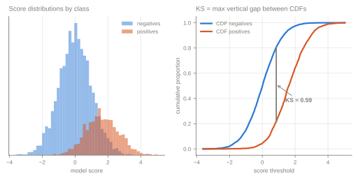

**How to read it**: plot the cumulative distribution of scores for positives and for negatives. **KS is the maximum vertical gap between them** — the single threshold at which the two classes are most separated. Range 0 (no separation) to 1 (perfect).

**Where it's used**: standard in credit risk and banking model validation, often with rough conventions like KS < 0.20 weak, 0.30-0.50 good — though the meaningful bar is entirely portfolio-dependent, so treat any fixed band as a local convention rather than a law.

**Relationship to AUC**: both measure ranking separation and they move together, but KS reports the separation at the *single best* threshold while AUC integrates over all of them. KS also tells you *where* that best cut is, which is operationally useful.

**Gotcha**: KS reduces the whole curve to one point, so two models with identical KS can behave very differently everywhere else. Report it alongside AUC/gains, not instead of them.

---

# Part 6 — Regression Diagnostics

## 14. Residual plots

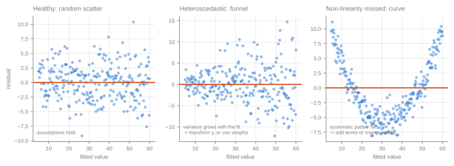

**How to read it**: plot residuals (`actual − predicted`) against **fitted values**. You want **structureless noise centred on zero**. Any visible pattern is signal the model failed to capture.

| Pattern | Diagnosis | Fix |
|---|---|---|
| Random scatter around 0 | Healthy | — |
| **Funnel / cone** (spread grows with the fit) | **Heteroscedasticity** — non-constant error variance | Log/Box-Cox the target, weighted least squares, or robust standard errors |
| **Curve / U-shape** | Non-linearity the model missed | Add polynomial or spline terms, interactions, or switch model family |
| Residuals trending with row order or time | Autocorrelation | Add lags, use a time-series model |
| A few points far out | Outliers / high-leverage points | Investigate; consider robust regression |
| Discrete bands | Target is really ordinal/count | Use a matching GLM |

**What heteroscedasticity actually breaks**: the coefficient estimates stay unbiased, but the **standard errors are wrong**, so p-values and confidence intervals become untrustworthy. Point predictions are still usable — inference isn't. That precision is worth stating.

**Gotcha**: plot residuals against **fitted values**, not against the actual target. Residuals are mathematically correlated with the actuals (`resid = actual − pred`), so that plot shows a spurious trend even for a perfect model. Common mistake, easy to catch.

## 15. Correlation traps

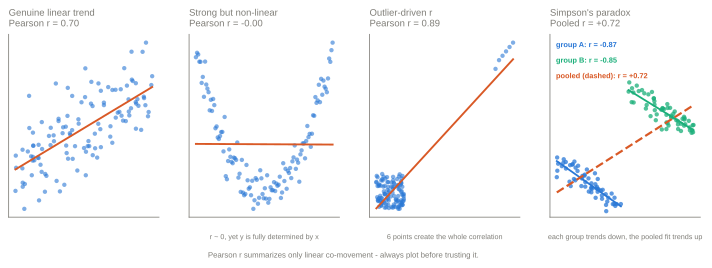

**How to read it**: Pearson **r** measures only the strength of a *linear* relationship. Each of the last three panels shows how that single number lies.

- **Non-linear**: r ≈ 0, yet y is perfectly determined by x. r cannot see a parabola. (Spearman's rank correlation catches monotonic-but-curved relationships; nothing linear catches a U.)
- **Outlier-driven**: r = 0.91 produced almost entirely by six points. Remove them and the correlation vanishes. Always check whether a strong r survives its extremes.
- **Simpson's paradox**: within each group the relationship is strongly *negative* (r ≈ −0.9), yet pooled it's strongly *positive* (+0.70). The aggregate reverses the sign of every subgroup. This happens whenever group membership is correlated with both x and y — i.e. a confounder — and it's the canonical argument for stratifying before concluding anything.

**Gotchas**: r is scale-invariant but not robust; it says nothing about slope magnitude; and correlation with the target is a weak feature-selection criterion precisely because it misses non-linear and interaction effects (see [`Feature_Engineering_Selection.md` §2](Feature_Engineering_Selection.md#2-feature-selection)). Mutual information is the non-linear alternative.

**The one-line answer**: always plot before trusting a correlation coefficient. Anscombe's quartet and the Datasaurus dozen are the canonical demonstrations that wildly different data can share identical summary statistics.

---

# Part 7 — Clustering

## 16. Elbow method vs silhouette score

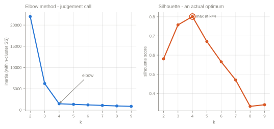

**How to read it**: the **elbow** plots inertia (within-cluster sum of squares) against k. Inertia always falls as k rises — at k = n it's zero — so you look for the *bend* where marginal improvement drops off. That's a judgement call, and on real data the bend is often ambiguous.

The **silhouette score** is better defined. For each point: `s = (b − a) / max(a, b)` where `a` is its mean distance to its own cluster and `b` its mean distance to the nearest other cluster. Range −1 to 1; average over all points and pick the k that maximises it. It has an actual optimum, not a kink you have to squint at.

**Other approaches**: gap statistic, Davies-Bouldin (lower is better), Calinski-Harabasz (higher is better), BIC/AIC for Gaussian mixtures (which is the principled choice when you're willing to assume a generative model).

**Gotchas**
- Neither metric knows about *usefulness*. A statistically clean k=2 split may be worthless if the business needs actionable segments; validate clusters against domain meaning and stability across resamples.
- Both assume roughly spherical, comparable-density clusters — the same assumption K-Means makes. For elongated or variable-density structure they mislead, and DBSCAN (which needs no k at all) is the better tool.
- Silhouette is computed on distances, so **scale your features first**, or the metric just reflects whichever feature has the largest units.

---

## Quick lookup: "which plot answers this question?"

| Question | Plot |
|---|---|
| Is my data normal? | QQ plot (§4) |
| Is my data skewed, and which way? | Histogram with mean/median (§1) |
| Do I have outliers? | Box plot (§3), residual plot (§14) |
| Am I underfitting or overfitting? | Learning curves (§6), bias-variance (§5) |
| Will more data help? | Learning curves (§6) |
| Is my classifier any good on imbalanced data? | PR curve (§9), confusion matrix (§8) |
| Where do I set the threshold? | Precision/recall vs threshold (§10) |
| Can I trust the predicted probabilities? | Calibration curve (§11) |
| How good is the top 1% of my ranking? | Gains / lift (§12), KS (§13) |
| Are my regression assumptions violated? | Residual plots (§14), QQ plot of residuals (§4) |
| Is this correlation real? | Scatter plot, always (§15) |
| How many clusters? | Elbow + silhouette (§16) |
